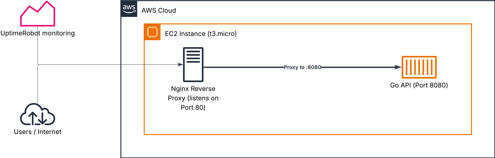
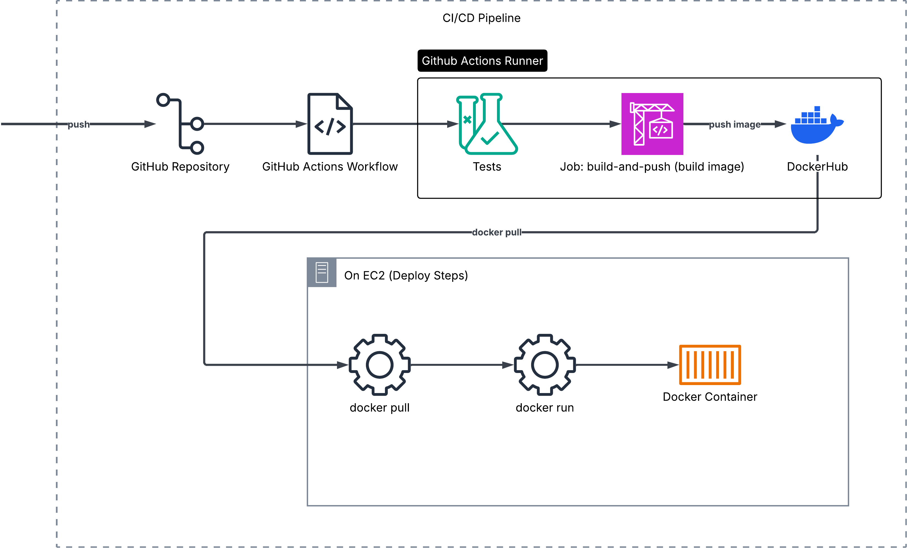

# Go-health-api

[](https://github.com/dfbello/go-health-api/actions/workflows/ci.yaml)

A simple Health Check API written in Go, built as a full-stack deploy pipeline demonstration with Docker, GitHub Actions CI/CD, and AWS EC2.
* A containerized backend service, running in AWS EC2.
* A GitHub Actions Workflow for Integration and Deployment. 
* Nginx as a reverse proxy. 
* UptimeRobot free tier monitoring.

## Architecture
- **Tech Stack:** A Golang API, containerized with Docker and running inside a t3.micro instance on AWS. Nginx is set up as a reverse proxy on the EC2 instance, and UptimeRobot for uptime monitoring.
- **Request Flow:** Internet -> Nginx (Port 80) -> Docker container (Port 8080) -> Go API
- **CI/CD:** [test] On push to main: Go test Suite -> [build-and-push] Build Docker Image -> Push to DockerHub -> [Deploy] SSH into instance -> Pull from DockerHub and run container.


## CI/CD
The `.github/workflows/ci.yaml` is a simple CI/CD workflow that runs on every push to the main branch and is comprised by the following jobs:
- **test:** Runs the Go test suite.
- **build-and-push:** If the test job is successful, builds the docker image, tags it with the commit SHA and pushes it to DockerHub.
- **deploy:** If the build-and-push job passes, it connects to an AWS EC2 instance via SSH and pulls the docker image to update the container running with the latest version.


## Live URL
I have an AWS ec2 instance running this API. You can hit the health endpoint like so:
```bash
curl -X GET http://18.225.11.202/health
```

## Running the web server
### How to run locally
You can either use `go run main.go` on the root directory or run the executable file product of running `go build`.

### Docker
You can build the image and run the container easily thanks to the provided `Dockerfile`:

```bash
$ docker build -t my:tag .
$ docker run -p PORT:8080 my:tag
```
**Note:** Remember to replace `PORT` with your desired host port, e.g. `8080:8080`.
Alternatively you can use the latest Docker [image](https://hub.docker.com/repository/docker/dfbello/go-health-api/general) `docker pull dfbello/go-health-api:latest`.

## Endpoints
- **"/":** returns a json body with a simple message on success.
```bash
$ curl -X GET http://127.0.0.1:8080/
{"message": "Health API is up and running"}
```
- **"/health":** returns a 200 OK http status code and a simple json on success. Means the api is up and running.
```bash
$ curl -X GET http://127.0.0.1:8080/health
{"status": "ok"}
```
If you use any other method e.g. POST, you will get a **405 Method Not Allowed**.
```bash
$ curl -X POST http://127.0.0.1:8080/health
Method Not Allowed
```
